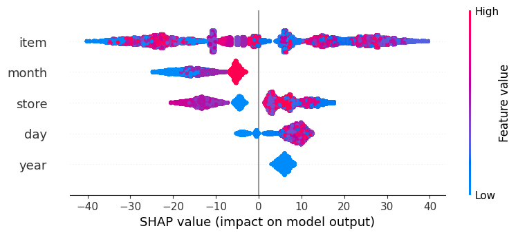
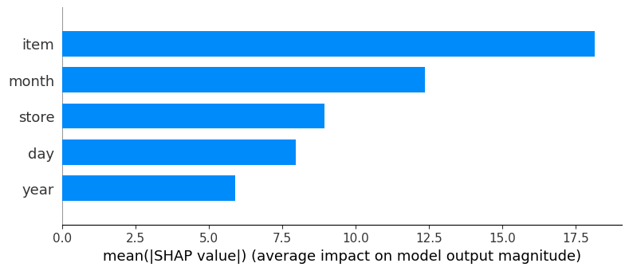
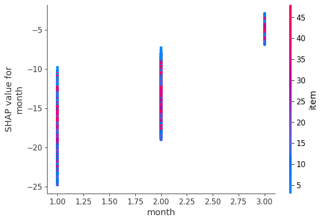

# 🚀 Explanation of SHAP Plots

SHAP (SHapley Additive exPlanations) helps interpret **feature importance** and their **effects on model predictions**. Below are explanations of the three generated plots.

---

## 📊 1️⃣ SHAP Summary Plot (Feature Importance & Impact on Predictions)

### 🔹 Interpretation
- Each **dot** represents a row in the dataset.
- The **x-axis** shows the SHAP value, which represents the **impact of that feature** on the model’s output (sales prediction).
- **Negative SHAP values** → Lower predicted sales.
- **Positive SHAP values** → Higher predicted sales.
- **Color represents feature values** (e.g., **blue = low value, red = high value**).
- **Insights from this plot**:
  - `item` has the **largest impact** on sales predictions.
  - `month` also plays a **major role**, indicating seasonal effects.
  - `store`, `day`, and `year` have **moderate influence**.

---

## 📊 2️⃣ SHAP Bar Plot (Mean Absolute Feature Importance)

### 🔹 Interpretation
- This plot shows **how much each feature contributes on average** to the model’s output.
- The **longer the bar, the more important the feature**.
- **Insights from this plot**:
  - `item` is the **most important feature**.
  - `month` has the **second-highest impact**, confirming seasonality matters.
  - `store`, `day`, and `year` have **lower but still significant contributions**.

---

## 📊 3️⃣ SHAP Dependence Plot (Feature Interaction - `month`)

### 🔹 Interpretation
- The **x-axis** shows the `month` feature.
- The **y-axis** shows SHAP values (**impact of `month` on predictions**).
- Each **dot represents a data point**.
- **Color represents another feature (`item`)** to show **interactions**.
- **Insights from this plot**:
  - Certain **months have a strong negative or positive impact** on sales.
  - There’s a clear **pattern of seasonality**, with **some months leading to higher/lower predictions**.
  - The **effect varies depending on the `item`**, as seen by the color variation.

---

## 🚀 Key Takeaways
✅ `item` is the **strongest predictor** of sales.  
✅ `month` confirms a **seasonal trend** in sales behavior.  
✅ **SHAP dependence plot** shows **seasonal effects differ by item**.  

Would you like to generate SHAP interaction plots for other features? 🚀😊